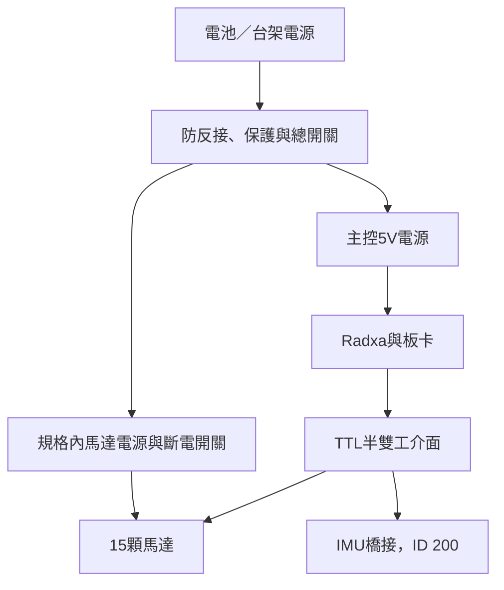

# 04｜電路板製造、供電與接線

> 路線 A：官方 alpha / Radxa 參考。本次要跟帆哥製作，請改讀 [路線 B（11–14章）](11-fange-start.md)，勿混用ID、列印比例與操作命令。

## 必須先解決的供電衝突

官方 `duck-control/src/model.rs` 記載NP-F550 2S電池、馬達總線電壓6.6–8.2V範圍，並在啟動時設定`shutdown=52`。零售XL330-M288-T的ROBOTIS規格卻是3.7–6.0V、建議5V。**程式有這個設定不代表零售馬達可以承受8.4V。** 暫時無法證明量產馬達與零售版完全相同。

因此本專案不提供2S直接零售XL330的接線操作。先以5V限流電源、原廠設定工具做單馬達測試。最終有兩條路：取得供應商明確確認相容的整組硬體；或做規格內馬達電源及runtime／策略適配。後者是研發工作，不能宣稱插上就走。

規格內電源分支示意（工程設計方向，非已驗證電路圖）：

各訊號地須有明確共地設計，功率回流不能靠細訊號地線承擔。選DC/DC須確認連續功率、啟動／峰值、散熱、反向電流／回生處理；單顆5V失速電流1.47A，15顆同時失速理論約22.05A，這是故障上界參考，不是正常平均耗電，也不能用來證明現有HAT／插頭承受得住。用實測波形決定配電與保護。

## 改穩壓供電後，軟體也要改

官方用馬達回報電壓當電池電壓，5V會被當成空電；`BATTERY_EMPTY_V`不是單純使用者配置欄位。只關閉低電保護會掩蓋真實電池狀態。

需要獨立電池量測或等效可靠BMS狀態，調整電量／低電處理與動作縮放，保留馬達軌電壓診斷；再重新量馬達扭矩速度、PD／延遲、質量重心並驗證或重訓策略。正式設計前不能以官方daemon直接啟動這套改裝硬體，因為啟動會寫馬達保護暫存器。

## HAT PCBA下單

來源固定：`pollen-robotics/elec_RPI_Robot_HAT` @ `88d51faf7f5fcc845d2e3b42d4f05ebb98b963b9`。

| 檔案 | 用途 |
|---|---|
| `production/PCB01186-C1_elec_RPI_Robot_HAT_PCB.zip` | PCB製板Gerber包 |
| `production/ASE01187-C1_elec_RPI_Robot_HAT_BOM.csv` | 元件料表與LCSC料號 |
| `production/ASE01187-C1_elec_RPI_Robot_HAT_POS.csv` | 貼裝位置；業者可能需要欄位轉換 |
| `production/ASE01187-C1_elec_RPI_Robot_HAT_SCH.pdf` | 接線、供電與元件核對 |
| `production/ASE01187-C1_elec_RPI_Robot_HAT_STEP.zip` | 板卡3D試裝 |
| `elec_RPI_Robot_HAT.kicad_pcb` | KiCad原始板檔、層數／板厚依據 |

KiCad資料為4層、1.0mm板厚。先向PCBA業者提供整套固定版本，要求報最小訂購量、缺料清單、替代件及是否含通孔焊接／功能測試。原廠BOM有DNP項，不可因LCSC欄位有料號就全部裝上；U10在BOM為LM5050-1、非DNP，須和原理圖／板圖比對。不要把fiducial當電子元件採購。

板上包括TLV320AIC3104、PAM8406、MEMS麥克風及BMI088。官方runtime主要平衡訊號來自**另板LSM6DSV16X**。有HAT的BMI088不代表可以省掉控制IMU。

收板：先查焊接、方向、短路→限流供電測電源軌→確認接頭極性→只接主控→最後單顆馬達。HAT規格允許的輸入範圍不能套到馬達或Radxa上。

## 控制IMU的缺口與可落地路徑

`pollen-robotics/imu_to_dxl` 本次GitHub API回404，clone也無法取得；可能非公開或目前連線不可存取，不能據此斷言它不存在。取得不到完整製造資料前，不能提供「下載就燒好」的韌體操作。

方案A：自行向Pollen確認能否取得v2完成板、相容韌體、pinout、安裝方向及授權。詢問模板在09章。

方案B：自製橋接板，以官方host端資料協定為規格；LSM6DSV16X＋MCU＋半雙工TTL，或另外實作host IMU驅動。可公開讀到的相容條件：

| 項目 | 官方host期望 |
|---|---|
| 總線 | Dynamixel Protocol2.0，1Mbps，ID200 |
| 控制讀取 | 位址124起12 bytes |
| 前6 bytes | gyro x/y/z：各int16小端，±500dps，17.5mdps/LSB |
| 後6 bytes | SFLP quaternion x/y/z：各IEEE float16；host重建w |
| 安裝轉換 | trunk = `[+raw_z,+raw_y,-raw_x]`；需與實際裝法一致 |
| Fast Sync Read | 預設使用0x8A；不支援時必須在daemon設定普通sync read，仍須達成50Hz |

這個表僅是主機側可見介面，**不等於完整韌體規格**。需實作封包CRC／byte stuffing／時序、SFLP初始化、更新率與新鮮度、錯誤回覆、watchdog、同步讀取及電氣轉向。驗證先在台架上做；靜止、繞三軸、翻轉及拔線時都要確認狀態合理，禁止以固定假數據讓策略「通過」健康檢查。

## 接線核對表

| 連接 | 條件 |
|---|---|
| Radxa→馬達介面 | 上游使用`/dev/ttyS2`；須經正確TTL半雙工電路，不把TX/RX直接接馬達DATA |
| TTL線 | 3-pin GND／V+／DATA逐腳按原廠圖查；TTL不是RS-485、RS-232或普通PWM舵機 |
| IMU | 與馬達同bus、ID200；實際板pinout未確認就不通電 |
| HAT I²C | Radxa overlay使用I2C3 M0，header pins3/5；音訊codec0x18、ToF常用0x29 |
| I²C mux | 上游overlay會重配I2C3，與原FUSB302用途有關；不要任意疊加其他板的overlay |
| CSI相機 | 關機斷電再插排線，核對兩端pin數／間距／接觸方向 |
| 喇叭 | 功放输出按原理圖接；不要自行把其中一端接GND |

電路未知處均保留「待確認」，本版不虛構完整線束pinout。施工時依實際revision畫接線圖、逐線量通斷，拍照後再通電。
