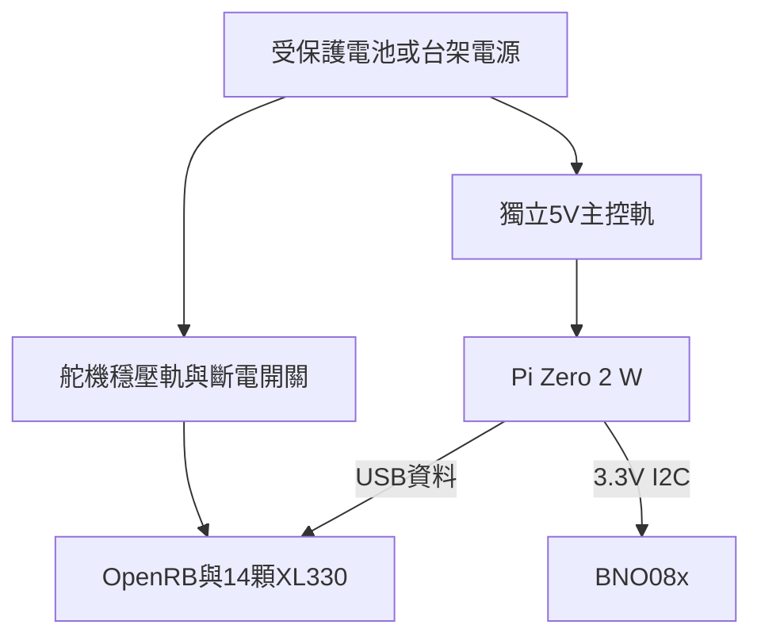

# 13｜帆哥路線：接線、刷機、校正與第一次行走

先完成 [12章採購與試印](12-fange-parts-printing.md)。以下控制命令會讓馬達動作，只有在14軸組裝、方向、零位與電源檢查通過後才執行 `main.py`。初始化會自動開扭矩並回neutral，不是等按v才第一次動。

## 1. OpenRB與供電

1. 斷電接線，依 [ROBOTIS OpenRB手冊](https://emanual.robotis.com/docs/en/parts/controller/openrb-150/) 的 **Terminal VIN** 接法，把電源選擇jumper放在 `VIN(DXL)` 側；以手冊照片核對，不以杜邦線顏色判定極性。
2. 舵機穩壓電源經保險絲與可及的斷電開關接Terminal VIN；本路線先5V台架，供電邊界見12章。OpenRB的輸入容許範圍不等於XL330容許範圍。
3. Pi的 `PWR IN` 接獨立穩定5V；Pi的 `USB` 埠經OTG與資料線連OpenRB USB-C。外部電源与USB同时使用時依原廠接法，確認沒有外部VDD回灌Pi。
4. 舵機分左右腿與頭頸三條支路，GND/VDD/DATA逐端對照。不要帶電插拔。
5. OpenRB須有 `usb_to_dynamixel` sketch：原廠預裝，支援至1Mbps；若被改寫，依原廠Arduino Board Manager說明重新燒錄。先在電腦Dynamixel Wizard 2.0確認能掃到單顆馬達，再接Pi。若DXL燈不亮，檢查橋接韌體、電源FET與jumper，不直接短接繞過。



圖為電源功能架構，不能代替實際接頭pinout；桌面兩路電源可先分開供應，共地且不並聯輸出。

## 2. IMU接線與固定

| BNO08x模組 | Pi GPIO名稱 | 40-pin實體腳位 |
|---|---|---:|
| 3.3V輸入（依模組手冊VIN/3V3定義） | 3V3 | 1 |
| GND | GND | 6 |
| SDA | GPIO2/SDA1 | 3 |
| SCL | GPIO3/SCL1 | 5 |

模組須設定成I²C模式，SDA/SCL上拉不可拉至5V；其餘PS、RST、INT脚按所購模組手冊處理，不臆測通用接法。I²C bus 1、常見位址由程式探測。固定在軀幹，記錄板上軸標記與照片；不要黏在鬆動頭殼上。

## 3. 逐顆設定舵機，不裝腿先測

在Dynamixel Wizard一次只接一顆，掃描出廠baud與ID→保存原控制表→設定唯一ID、Protocol 2.0與1Mbps→重新掃描驗證→貼標籤。作者推薦Return Delay Time=0、PWM Slope=255；先確認該FW支援並記錄原值。**保留輸入電壓錯誤保護**；作者README建議去掉該Shutdown位元，本專案不照抄，以修正電源代替取消保護。

| ID | 名稱 | 部位 |
|---:|---|---|
| 1 | right_ankle | 右踝 |
| 2 | right_knee | 右膝 |
| 3 | right_hip_pitch | 右髖俯仰 |
| 4 | right_hip_roll | 右髖橫滾 |
| 5 | right_hip_yaw | 右髖偏航 |
| 6 | left_ankle | 左踝 |
| 7 | left_knee | 左膝 |
| 8 | left_hip_pitch | 左髖俯仰 |
| 9 | left_hip_roll | 左髖橫滾 |
| 10 | left_hip_yaw | 左髖偏航 |
| 11 | head_pitch | 頭俯仰 |
| 12 | neck_pitch | 頸俯仰 |
| 13 | head_yaw | 頭偏航 |
| 14 | head_roll | 頭橫滾 |

先以限流5V讀位置／電壓，再在無負載可動範圍做小角度正反轉並卸力。整機模式應為Position Control（Operating Mode=3），扭矩關閉時設定，依XL330手冊確認；不要把PWM模式當位置模式。ID15嘴部本輪不裝、不列入14軸測試。

裝舵盤前對照影片的機械基準與軸方向。不要把「舵機raw中心」、「模型0 rad」和「站立neutral」視為同一件事。

## 4. 刷寫系統映像（開發電腦）

使用 [作者image.v1映像](https://github.com/AI-FanGe/Microduck-build-tutorial/releases/download/image.v1/microduck.img.xz)。本次未下載／刷寫大型映像；作者README公布SHA256為：

```text
096885dc32fb5b1db2ad69ba6bea868d8ab988f2b47c0d884eb63ba0dfdcb5c4
```

下载後在macOS：`shasum -a 256 microduck.img.xz`；Linux：`sha256sum microduck.img.xz`；Windows PowerShell：`Get-FileHash .\microduck.img.xz -Algorithm SHA256`。比對完整64字元；不一致先停，不跳過。

用Raspberry Pi Imager→選Zero 2 W→Use custom選此xz→仔細選SD卡→若提示OS customization，依作者要求選No→Write並完成Verify。此動作會清除所選卡，確認不是電腦磁碟。

刷完重新插卡，在bootfs的 `network-config` 修改國家碼 `TW`、Wi-Fi SSID與密碼，維持YAML縮排；使用2.4GHz網路。未出現此檔時，不創建猜測格式，改接mini-HDMI與USB鍵盤登入後用 `nmcli` 設Wi-Fi。不要在Git保存真實網路密碼。

首次**不接舵機電源、不開手柄**，Pi上電等待1–3分鐘。在電腦：

```bash
ssh user@microduck.local
```

作者預設密碼 `password`；登入後立即執行 `passwd`。`.local`失敗時從路由器確認IP改用IP連線。若host key變更，先確認是自己重刷的板卡再刪舊記錄，不盲目忽略警告。

## 5. 先停用手柄自動啟動，核對軟體（Pi）

```bash
sudo systemctl disable --now microduck-gamepad.service
cd ~/microduck
.venv/bin/python --version
.venv/bin/python -c 'import onnxruntime; print(onnxruntime.__version__)'
ls /dev/serial/by-id/
ls /dev/i2c-1
```

若I²C缺失，用 `sudo raspi-config` 的介面設定啟用I²C後重開機。OpenRB應有 `usb-ROBOTIS_OpenRB-150_*`，不要讓程式默默fallback到不明UART後繼續。

映像發布標籤不保證與本手冊鎖定commit一致。先備份Pi上的程式及校正值，**不要一開始就用 `make setup` 更新全部依賴**：

```bash
cd ~
cp -a microduck "microduck-backup-$(date +%Y%m%d-%H%M%S)"
```

核對 `src/constants.py`、`robot_controller.py`、`observer.py`、`scheduler.py`、`moves/walk.py`、`main.py` 與鎖定版；保留差異。若要採用本手冊鎖定源碼，在開發電腦的 `Microduck-FanGe/microduck` 執行：

```bash
make sync HOST=user@microduck.local
```

此命令會覆寫Pi部署目錄內相同路徑的程式與模型，但保留`.venv`；先備份再做。同步後核對依賴是否符合該版 `pyproject.toml`（Python≥3.12、onnxruntime≥1.26.0等）。若不符，先在備份卡上處理依賴再測，不能宣稱現成映像與目前源碼已保證配套。

### 無馬達ONNX檢查（Pi，仍不接舵機電源）

```bash
cd ~/microduck
.venv/bin/python - <<'PY'
import onnxruntime as ort
import numpy as np
import sys
sys.path.insert(0, 'src')
from constants import OBSERVATION_DOF_ORDER
s = ort.InferenceSession('src/agents/walk.onnx', providers=['CPUExecutionProvider'])
i, o = s.get_inputs()[0], s.get_outputs()[0]
m = s.get_modelmeta().custom_metadata_map
print(i.name, i.shape, o.name, o.shape)
assert i.shape == [1, 51] and o.shape == [1, 14]
assert m['joint_names'].split(',') == OBSERVATION_DOF_ORDER
assert len(m['default_joint_pos'].split(',')) == 14
assert float(m['action_scale']) == 1.0
a = s.run(None, {i.name: np.zeros((1, 51), dtype=np.float32)})[0]
assert np.isfinite(a).all()
print('PASS: interface and finite values; not a walking test')
PY
```

本次實際查驗鎖定模型為 **51輸入／14輸出**；不含phase。51=gyro3+gravity3+位置14+速度14+上一動作14+速度命令3。模型SHA在 [lock](../data/fange-lock.json)，Pi可用 `sha256sum src/agents/walk.onnx` 比對。零輸入測試只能確認接口及有限數值，不代表能站立。

## 6. IMU及零位：此段不得略過

Pi端、舵機電源關閉：

```bash
cd ~/microduck
PYTHONPATH=src .venv/bin/python src/imu_orientation_check.py --skip-yaw
```

依提示擺直立、頭向下／上、左／右傾，各保持靜止並按Enter；結果存 `logs/imu_orientation_check/latest.json`。檢查valid、age、error_count以及body-frame projected_gravity。直立body診斷重力應接近 `[0,0,-1]`，傾斜方向與模型一致。**policy的gravity使用另一個IMU frame與符號約定，不能把body診斷值直接塞給policy。**

`IMU_MOUNT_QUAT=(0.7071068,0,0.7071068,0)` 是作者安裝方向。若板向不同，應重新推導旋轉並核對gyro與重力兩者，不以反轉一個軸湊到站立。

`constants.py` 的 `MOTOR_SIGN` 全為+1，右膝ID2的 `MOTOR_OFFSET` 是+45°，左膝ID7是−45°。這是作者實物組裝，不是所有人的通用出廠參數。轉換關係是：`硬體目標rad = 模型目標rad × sign + offset`。

逐軸紀錄：實物基準姿態→讀硬體位置→與模型基準比較→決定sign及offset→小角度正反向驗證→回neutral檢查。避免同時改舵機EEPROM Homing Offset及軟體offset造成重複補償。無法確定時停在單軸，回看影片或模型，不直接動整機。

作者提供 `make direction-check-sim`（不連真機）及 `make direction-check HOST=user@microduck.local`（會連真機並可能動馬達）；後者只在支撐、逐軸確認環境執行，先讀其腳本說明，不當作無動作診斷。

## 7. 第一次整機啟動：支撐、鍵盤、可實體斷馬達電源

先開第二個SSH視窗備好停止命令。只在14軸及IMU全通過後執行，**不適用只有1顆／5顆的台架**。先按14章處理啟動失敗與失聯停機檢查，再進入自由行走。

Pi第一視窗：

```bash
cd ~/microduck
MICRODUCK_INPUT=keyboard PYTHONPATH=src .venv/bin/python src/main.py
```

程式立即開扭矩，以KP_DEFAULT=400在約2秒內移向neutral。觀察有無反向、撞殼、卡線、過流；異常直接斷舵機電源。切入walk的KP_RL=125是作者設定，不能當工業保護限值。

| 鍵盤 | 功能 |
|---|---|
| v | 切換行走策略 |
| ↑／↓ | 前進／後退命令 |
| ←／→ | 轉向命令 |
| x | 速度命令歸零（仍可能持續平衡／出力） |
| i | 顯示IMU狀態 |
| q | 結束控制循环，正常cleanup嘗試卸力 |

首次不要直接按方向鍵使用原速度上限。建議先備份並把constants中的 `VX_MAX`、`VX_MAX_BACKWARD` 設0.10、`VY_MAX`設0.05、兩個 `VTHETA_MAX_*` 設0.30，單位m/s及rad/s；此為專案初測建議，不是已驗證最佳參數。逐次記錄變更。

第二視窗停止：

```bash
cd ~/microduck
PYTHONPATH=src .venv/bin/python src/stop.py
```

這是軟體停止請求，不是斷電急停。若沒反應或SSH斷線，使用實體舵機電源開關。停機後確認卸力／穩定支撐，再執行 `sudo shutdown -h now`；等待Pi關機完成後切主電源。

## 8. 鍵盤驗收後才開手柄

使用 `bluetoothctl` 的 `power on`、`agent on`、`scan on` 找手柄，對實際MAC依次 `pair`、`trust`、`connect`，最後 `scan off`、`quit`。Pi上再啟用：

```bash
sudo systemctl enable --now microduck-gamepad.service
```

作者映像設計：START按住2秒啟動，A切walk，左搖桿前後／側移，右搖桿左右轉，B停控制，雙扳機按住2秒關機。不同手柄須驗證按鍵映射。

**服務會在手柄連接後關Wi-Fi；需要SSH時關手柄，Wi-Fi才恢復。** 先測失聯停止，再使用此模式；不要把SSH當唯一停止手段。不要同時啟動鍵盤與手柄兩個控制迴圈。

## 故障排除順序

| 現象 | 先查 |
|---|---|
| USB板有出現但舵機掃不到 | 橋接sketch、DXL燈、jumper、外部電源、轉接線、Protocol／baud |
| 一上電neutral亂動 | 馬達ID、Operating Mode、sign、兩膝offset及舵盤裝配；立即停止 |
| IMU stale／invalid | I²C模式、3.3V、線長、軸向、讀取age；不以略過警告解決 |
| ONNX維度錯誤 | 混入官方61維模型／不同commit，恢復鎖定51維模型 |
| SSH突然斷線 | 手柄服務是否關Wi-Fi；關手柄再查，不反覆重刷卡 |
| 多軸動作時Pi重啟 | 5V壓降、共地、USB回灌、接頭與電源容量 |
| 有鏡像卻缺依賴 | 映像與源碼版本差異；回復備份卡，不盲目全套升級 |
